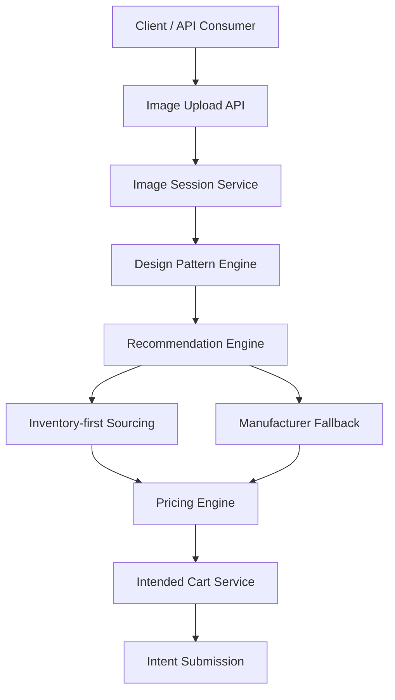

# Visual Sourcing Platform  
### B2B Jewellery · Backend MVP

A backend-first system that transforms **visual inspiration into commercially viable jewellery recommendations**, while maintaining **inventory priority, pricing control, and supplier abstraction**.

This project is a **working MVP** aligned with the provided BRD and demonstrates the complete external user journey through APIs.

---

## 📋 Overview

The Visual Sourcing Platform enables buyers to upload a reference image and receive structured jewellery recommendations based on design patterns, inventory availability, and platform-controlled pricing.

The system intentionally focuses on **core business logic** rather than UI or production hardening, making it suitable for validating sourcing workflows within a short development cycle.

---

## 👥 Who Is This For?

This project is designed for:

- B2B jewellery platforms
- Assisted commerce workflows
- Sales and sourcing teams
- Marketplaces prioritizing inventory utilization
- Systems that require pricing control and supplier abstraction

This MVP is **not intended** for direct-to-consumer checkout or automated fulfillment.

---

## ✨ Key Capabilities

- 📸 Reference image upload & session creation  
- 🧠 Design attribute extraction (mocked)  
- 🔁 Design pattern generation  
- 🏷️ Inventory-first recommendation engine  
- 🏭 Manufacturer fallback sourcing  
- 💰 Platform-controlled pricing logic  
- 🛒 Intent-based cart (no checkout, no payment)

---

## 🏗️ System Architecture



---

## 🛠️ Technology Stack

| Layer | Technology |
|-------|-----------|
| **Runtime** | Node.js (v25) |
| **Language** | TypeScript (ESM) |
| **Framework** | Express.js |
| **File Upload** | Multer |
| **Dev Runner** | tsx |
| **Storage** | In-memory (MVP) |

> **Note:** No database or frontend is used intentionally to focus on business logic validation.

---

## 📡 API Endpoints

### Health Check
```http
GET /health
```

**Response:**
```json
{
  "success": true,
  "message": "Visual Sourcing Backend is running"
}
```

---

### Image Upload
```http
POST /api/images/upload
```

**Form Data:**
- `image`: `<file>`

**Response:**
```json
{
  "success": true,
  "data": {
    "imageSessionId": "uuid",
    "filePath": "uploads/temp/...",
    "attributes": {
      "category": "RING",
      "shape": "ROUND",
      "stoneDensity": "MEDIUM",
      "metalVisibility": "HIGH",
      "finish": "POLISHED"
    },
    "status": "COMPLETED",
    "createdAt": "2025-02-12T10:30:00Z"
  }
}
```

---

### Generate Recommendations
```http
POST /api/recommendations
```

**Request Body:**
```json
{
  "attributes": {
    "category": "RING",
    "shape": "ROUND",
    "stoneDensity": "MEDIUM",
    "metalVisibility": "HIGH",
    "finish": "POLISHED"
  }
}
```

**Response:**
```json
{
  "success": true,
  "data": [
    {
      "type": "PRIMARY",
      "source": "INVENTORY",
      "productId": "INV_RING_001",
      "pricing": {
        "minPrice": 11600,
        "maxPrice": 11600
      },
      "moq": 10,
      "leadTime": "7 days"
    },
    {
      "type": "ALTERNATIVE",
      "source": "MANUFACTURER",
      "productId": "MFG_RING_101",
      "pricing": {
        "minPrice": 8700,
        "maxPrice": 10150
      },
      "moq": 50,
      "leadTime": "21 days"
    }
  ]
}
```

> **Note:** Returns one primary recommendation (inventory-first) + multiple alternatives (manufacturer fallback)

---

### View Cart
```http
GET /api/cart
```

**Response:**
```json
{
  "success": true,
  "data": {
    "id": "cart-uuid",
    "status": "DRAFT",
    "items": [],
    "createdAt": "2025-02-12T10:30:00Z"
  }
}
```

---

### Add Item to Cart
```http
POST /api/cart/add
```

**Request Body:**
```json
{
  "recommendation": {
    "type": "PRIMARY",
    "productId": "INV_RING_001",
    "pricing": {
      "minPrice": 11600,
      "maxPrice": 11600
    },
    "moq": 10,
    "leadTime": "7 days"
  },
  "quantity": 20
}
```

**Response:**
```json
{
  "success": true,
  "data": {
    "id": "cart-uuid",
    "status": "DRAFT",
    "items": [
      {
        "id": "item-uuid",
        "recommendation": { ... },
        "quantity": 20
      }
    ],
    "createdAt": "2025-02-12T10:30:00Z"
  }
}
```

---

### Submit Cart Intent
```http
POST /api/cart/submit
```

**Response:**
```json
{
  "success": true,
  "message": "Cart submitted successfully",
  "data": {
    "id": "cart-uuid",
    "status": "SUBMITTED",
    "submittedAt": "2025-02-12T10:35:00Z"
  }
}
```

---

## 🚀 Running the Project Locally

### Prerequisites
- Node.js v20+
- npm

### Setup
```bash
git clone <repository-url>
cd visual-sourcing-platform/backend
npm install
npm run dev
```

Server runs at: **http://localhost:3000**

---

## ✅ Validation & Testing

The system can be validated using:

- **curl** commands
- **Postman** requests
- End-to-end API flow testing

**No frontend UI is required** to demonstrate correctness.

### Example Test Flow

```bash
# 1. Upload image
curl -X POST http://localhost:3000/api/images/upload \
  -F "image=@sample-ring.jpg"

# 2. Generate recommendations
curl -X POST http://localhost:3000/api/recommendations \
  -H "Content-Type: application/json" \
  -d '{
    "attributes": {
      "category": "RING",
      "shape": "ROUND",
      "stoneDensity": "MEDIUM",
      "metalVisibility": "HIGH",
      "finish": "POLISHED"
    }
  }'

# 3. Add to cart
curl -X POST http://localhost:3000/api/cart/add \
  -H "Content-Type: application/json" \
  -d '{
    "recommendation": {
      "type": "PRIMARY",
      "productId": "INV_RING_001",
      "pricing": { "minPrice": 11600, "maxPrice": 11600 },
      "moq": 10,
      "leadTime": "7 days"
    },
    "quantity": 20
  }'

# 4. Submit cart
curl -X POST http://localhost:3000/api/cart/submit
```

---

## 📂 Project Structure

```
backend/
├── src/
│   ├── app.ts                    # Main application entry
│   ├── controllers/
│   │   ├── imageController.ts    # Image upload handling
│   │   ├── recommendationController.ts
│   │   └── cartController.ts     # Cart management
│   ├── routes/
│   │   ├── imageRoutes.ts        # Image endpoints
│   │   ├── recommendationRoutes.ts
│   │   └── cartRoutes.ts         # Cart endpoints
│   └── services/
│       ├── imageService.ts       # Image processing logic
│       ├── patternService.ts     # Design pattern generation
│       ├── recommendationService.ts  # Sourcing logic
│       ├── catalogService.ts     # Inventory & manufacturer data
│       ├── pricingService.ts     # Platform pricing
│       └── cartService.ts        # Cart state management
├── uploads/
│   └── temp/                     # Temporary image storage
├── package.json
└── tsconfig.json
```

---

## 🎯 Scope Decisions

### Implemented
- ✅ Core sourcing logic
- ✅ External user journey
- ✅ Inventory prioritization
- ✅ Platform pricing logic
- ✅ Intended cart flow

### Intentionally Deferred
- ⏳ Database persistence
- ⏳ Authentication & RBAC
- ⏳ Internal dashboards
- ⏳ Quotations
- ⏳ Notifications
- ⏳ External supplier integrations

> **Note:** These are documented as future enhancements, not omissions.

---

## 🔮 Future Enhancements

The architecture supports:

- Database integration (PostgreSQL/MongoDB)
- Role-based access control
- Internal sales dashboards
- Quotation workflows
- Supplier integrations (Alibaba API)
- Frontend UI (React/Vue)

**No core logic refactoring would be required** to add these features.

---

## 📝 Key Business Rules

### Sourcing Priority (BRD-Aligned)

1. **Inventory First** - Always check internal inventory before manufacturers
2. **Manufacturer Fallback** - Query external manufacturers only if inventory unavailable
3. **Platform Pricing** - Apply quality buffers + overhead + margin (supplier prices never exposed)
4. **Supplier Abstraction** - Supplier identities hidden from external users
5. **Assisted Commerce** - Cart submission triggers human review (no automated checkout)

### Recommendation Structure

- **1 Primary Recommendation** - Closest manufacturable match (inventory-first)
- **3-4 Design Alternatives** - Pattern-based similar designs
- **Consistent Pricing** - Same pricing rules applied to all tiles

---

## 🧪 Core Logic Validation

### Inventory-First Sourcing

```typescript
// Primary recommendation checks inventory FIRST
const inventoryMatch = inventoryCatalog.find(item =>
  item.category === pattern.category &&
  item.shape === pattern.shape &&
  item.stoneDensity === pattern.stoneDensity
);

if (inventoryMatch) {
  return createInventoryRecommendation(inventoryMatch);
}

// Only then check manufacturers
const manufacturerMatch = manufacturerCatalog.find(item =>
  item.category === pattern.category
);

return createManufacturerRecommendation(manufacturerMatch);
```

### Platform-Controlled Pricing

```typescript
const qualityBuffer = 0.15;      // 15%
const operationalOverhead = 0.10; // 10%
const margin = 0.25;              // 25%

const multiplier = 1 + qualityBuffer + operationalOverhead + margin;
const finalPrice = baseCost * multiplier; // Total: 50% markup
```

---

## 📊 Sample Data

### Inventory Catalog
```json
{
  "id": "INV_RING_001",
  "category": "RING",
  "shape": "ROUND",
  "stoneDensity": "MEDIUM",
  "metalVisibility": "HIGH",
  "finish": "POLISHED",
  "baseCost": 8000,
  "moq": 10,
  "leadTimeDays": 7
}
```

### Manufacturer Catalog
```json
{
  "id": "MFG_RING_101",
  "category": "RING",
  "shape": "ROUND",
  "stoneDensity": "MEDIUM",
  "metalVisibility": "HIGH",
  "finish": "POLISHED",
  "minCost": 6000,
  "maxCost": 7000,
  "moq": 50,
  "leadTimeDays": 21
}
```

---


Built as part of the Visual Sourcing Platform internship selection process.

Follows the Business Requirements Document (BRD) provided by the hiring team.

---

## 🏆 Key Achievements

✅ **BRD-Compliant** - All core business rules implemented exactly as specified  
✅ **Clean Architecture** - Service-based design with clear separation of concerns  
✅ **Type-Safe** - Full TypeScript implementation with proper typing  
✅ **API-First** - Validated through curl/Postman without UI dependencies  
✅ **Extensible** - Ready for database, auth, and frontend integration  
✅ **Documented** - Comprehensive methodology and technical documentation  

---

**Built with ❤️ for the Visual Sourcing Platform**
